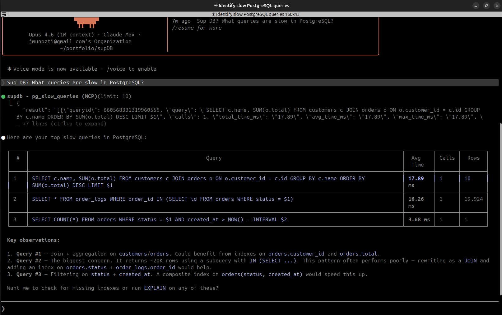
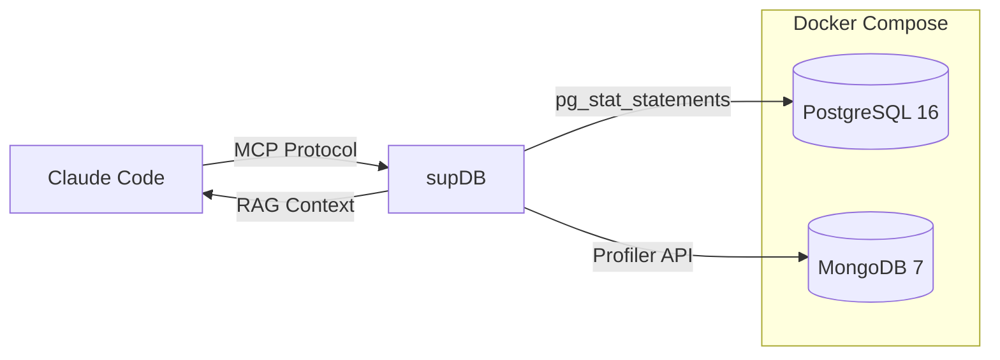

# supDB

> *"Sup, DB?" — an MCP server that checks what's up with your databases*

An MCP (Model Context Protocol) server for **Claude Code** that connects to PostgreSQL and MongoDB databases to find slow queries, suggest missing indexes, and provide performance recommendations using AI.



## Architecture



## What It Does

| Tool | Database | Description |
|------|----------|-------------|
| `pg_slow_queries` | PostgreSQL | Top slow queries from `pg_stat_statements` |
| `pg_explain` | PostgreSQL | `EXPLAIN ANALYZE` on SELECT queries (safe, read-only) |
| `pg_missing_indexes` | PostgreSQL | Tables with high sequential scans needing indexes |
| `pg_table_indexes` | PostgreSQL | List indexes on a table |
| `pg_table_stats` | PostgreSQL | Live/dead rows, vacuum status, bloat detection |
| `pg_schema` | PostgreSQL | Full schema: tables, columns, types, constraints |
| `pg_active_connections` | PostgreSQL | Active queries and connection states |
| `mongo_slow_queries` | MongoDB | Slow operations from the profiler |
| `mongo_collection_stats` | MongoDB | Collection size, document count, index info |
| `mongo_collection_indexes` | MongoDB | Index definitions on a collection |
| `mongo_missing_indexes` | MongoDB | COLLSCAN queries with suggested indexes |
| `mongo_collections` | MongoDB | All collections with sizes |
| `mongo_schema` | MongoDB | Inferred schema from sample documents |

**RAG Context**: The `db://context` resource provides Claude with a live snapshot of both databases (schemas, stats, missing indexes) so it can make informed recommendations without needing to call every tool first.

## Quick Start

### Prerequisites

- Docker and Docker Compose
- Python 3.11+
- [Poetry](https://python-poetry.org/docs/#installation)
- [Claude Code CLI](https://docs.anthropic.com/en/docs/claude-code) (`npm install -g @anthropic-ai/claude-code`)

### 1. Clone and enter the project

```bash
git clone https://github.com/jmunozti/supDB.git
cd supDB
```

### 2. Start the databases

```bash
make up
```

This starts PostgreSQL 16 and MongoDB 7 with:
- `pg_stat_statements` enabled for query tracking
- MongoDB profiler enabled for slow query capture
- Seed data: 10K customers, 500 products, 50K orders, 100K logs (PostgreSQL) and 10K users, 50K events, 5K products (MongoDB)
- **Intentionally missing indexes** for supDB to find

### 3. Install the MCP server

```bash
make install
```

### 4. Connect to Claude Code

Run this from the `supDB/` directory:

```bash
claude mcp add supdb \
  -e POSTGRES_HOST=localhost \
  -e POSTGRES_PORT=5432 \
  -e POSTGRES_USER=dbadmin \
  -e POSTGRES_PASSWORD=dbadmin123 \
  -e POSTGRES_DB=appdb \
  -e MONGO_HOST=localhost \
  -e MONGO_PORT=27017 \
  -e MONGO_USER=dbadmin \
  -e MONGO_PASSWORD=dbadmin123 \
  -e MONGO_DB=appdb \
  -- poetry --directory "$(pwd)/mcp-server" run python server.py
```

Verify it's connected:

```bash
claude mcp list
# supdb: ✓ Connected
```

If it shows `✗ Failed to connect`, check that Docker containers are running (`docker ps`) and that `make install` completed without errors.

### 5. Use it

Open a **new** Claude Code session and ask:

```
"Sup DB? What queries are slow in PostgreSQL?"
"Find missing indexes in MongoDB"
"Analyze the orders table performance"
"Which collections need indexes?"
"Explain this query: SELECT * FROM orders WHERE status = 'pending'"
```

## Example Output

```
> "Sup DB? What queries need optimization?"

Claude will:
1. Read the db://context resource for a full database snapshot
2. Call pg_slow_queries to find the top offenders
3. Call pg_explain on the slowest query
4. Call pg_table_indexes to check existing indexes
5. Respond with specific CREATE INDEX recommendations
```

## Development

```bash
make install    # Install dependencies
make lint       # Run ruff linter
make format     # Auto-format code
make test       # Run tests
make logs       # View database logs
make down       # Stop everything
make clean      # Stop and remove volumes
```

## Security

- `pg_explain` only accepts SELECT queries — all mutations are blocked
- Database credentials are required via environment variables — no defaults hardcoded. Copy `.env.example` to `.env` and set your own values (`make up` does this automatically for local dev)
- The MCP server runs in stdio mode (no network exposure)
- MongoDB and PostgreSQL are only exposed on localhost

## Tech Stack

- **MCP SDK** `1.9.2` — Anthropic's Model Context Protocol
- **PostgreSQL 16** — with `pg_stat_statements` extension
- **MongoDB 7** — with database profiler
- **Poetry** — dependency management
- **Ruff** — linting and formatting
- **GitHub Actions** — CI pipeline

## License

MIT
